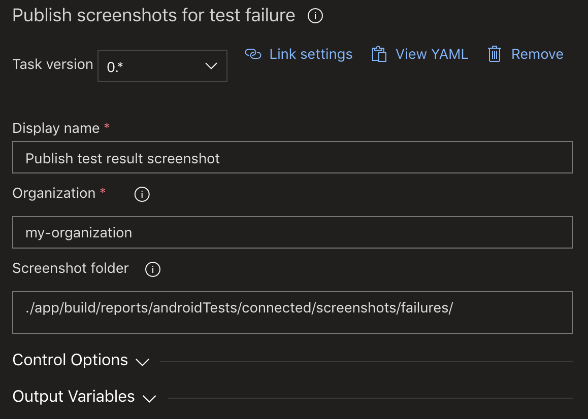

# PublishTestResultScreenshot for Azure DevOps
**DEPRECATED**: This Azure DevOps extension is no longer maintained.

Get more insight on your UI test failure with screenshots.

## Installation
You can get the task from the [Visual Studio MarketPlace](https://marketplace.visualstudio.com/items?itemName=Genetec.publish-test-result-screenshot).

## How to use
### Requirements
* Capture your screenshot on test failure using the following path `automatedTestStorage/automatedTestName` (*see [json response](https://docs.microsoft.com/en-us/rest/api/azure/devops/test/results/get?view=azure-devops-rest-5.1#examples) example*)
  * Currently only support `.png` images
* The task must be placed **after** the [PublishTestResult](https://docs.microsoft.com/en-us/azure/devops/pipelines/tasks/test/publish-test-results) task in your pipeline
* If you enabled *Fail build on test failure* on **PublishTestResult** task preceding **PublishTestResultScreenshot**, you will need to also enable the *Continue on error* to make sure **PublishTestResultScreenshot** is not skipped.

### Compatibility
Version 0.1.x is compatible with:
* Azure DevOps Service Cloud
* Test type: JUnit
* Microsoft-hosted agents: macOS 10.14 & 10.13, ubuntu16.04, win2019
> **NOTE** that emulators are currently only available on macOS agents, so for Android UI Testing you will be limited to 10.14 or 10.13, but the task is not dependent on macOS agents.

### Configure
#### Available inputs:
Required
* `organization`: specify your organizationName (*can be found from devops instance url http://dev.azure.com/{yourOrg}*)

Optional
* `screenshotFolder`: you can change where the task looks for screenshot, defaults to "./app/build/reports/androidTests/connected/screenshots/failures/"

#### Using classic editor


#### Using YAML
```yaml
- task: Genetec.publish-test-result-screenshot.pipeline-extension.PublishTestResultScreenshot@0
  displayName: 'Publish test result screenshot'
  inputs:
    organization: {yourOrganizationName}
    screenshotFolder: {yourCustomPath}
```
## Specifications
This task uses [azure-devops-node-api](https://github.com/microsoft/azure-devops-node-api) which, under the hood, uses the [Azure DevOps REST Api](https://docs.microsoft.com/en-us/rest/api/azure/devops/).

### Task Results
* `Succeeded` - All the screenshots were successfully uploaded
* `SucceededWithIssues` (2 self explained possibles messages)
  * Some/All screenshots upload failed AND/OR
  * Some/All screenshots files were missing
* `Skipped` - No test failures were found
* `Error` - Usually related to authentification, connection, networkError etc.

## How to build
### Prerequisites
You will need to install nvm, and npm with node to run this project.

* Install [nvm](https://github.com/nvm-sh/nvm#installation-and-update)
* Install node (npm is bundled)
  * `nvm install node`
  * `nvm use node`
* Install Typescript
  * `npm install typescript -g`


#### Verify versions
I used the latest version but just make sure that all commands return a version number.
* `nvm --version`
* `npm --version`
* `node --version`

### Getting started

#### Clone the repo
`git clone git@github.com:Genetec/azure-devops-extension-publishtestresultscreenshot.git`

#### Setup for local use
1. Uncomment the header of [index.ts](./PublishTestResultScreenshotV0/index.ts) and set input values
```
// **********************************************************************************
// ************************* FOR LOCAL USE ******************************************
// process.env.ENDPOINT_AUTH_PARAMETER_SYSTEMVSSCONNECTION_ACCESSTOKEN = ""
// process.env.SYSTEM_TEAMPROJECT = ""
// process.env.INPUT_ORGANIZATION = ""
// process.env.INPUT_SCREENSHOTFOLDER = ""
// process.env.BUILD_BUILDID = ""
// **********************************************************************************
```
2. Assign your access token to `ENDPOINT_AUTH_PARAMETER_SYSTEMVSSCONNECTION_ACCESSTOKEN`

#### Compile the typescript into javascript
* `cd PublishTestResultScreenshotV0`
* `npm install`
* `tsc`

#### Execute the task locally
* `node index.js`

#### Deploy and test on DevOps
Before submitting your PR, make sure to test your changes on your DevOps instance using the following command:
```
tfx build tasks upload --overwrite --task-path "myPathToTheTask" --service-url "https://myOrg.visualstudio.com/DefaultCollection" --auth-type pat -t "xxx"
```
> The PAT (*personal access token*) requires only the **Manage Agent Pool** permission.

## How to contribute
Check [Contribution Guide](./CONTRIBUTING.md)

## License
Published under [Apache 2.0](./LICENSE) License

